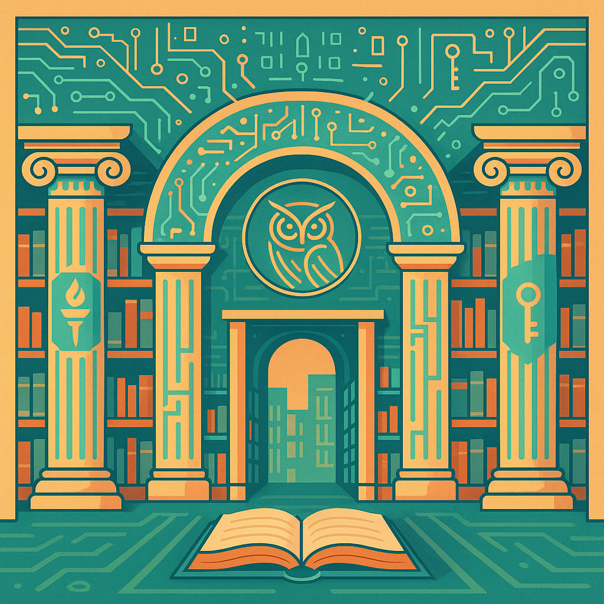

# Synth

## Towards Λήθη: The Book of Knowledge - The Memory Palace of Protoncracker

Welcome to **Synth**—the seed and first-draft concept for a greater vision: **Λήθη** (Lethe), a digital library that aspires to contain everything humanity knows, synthesized and accessible to all.

This project is my personal memory palace, a curated map of the digital world, and a living protest for the freedom of knowledge. Here, you'll find links and resources across the fields I know best—primarily Information Technology, Cybersecurity, Programming, and the deep realms of Occultism and Mythology.

---

### On Piracy, Ethics, and Access

I do **not** support piracy as a business or as a means for others to profit from the work of creators. I support the *spirit* of piracy as a protest against artificial barriers to knowledge. If you are poor, if you are struggling, if you are locked out of learning by circumstance—**you deserve access**.

But if you can afford to buy a book, a course, or a subscription, **please support the creators**. Buy, donate, and give back when you are able. The world is better when knowledge flows freely *and* when creators are rewarded for their work.

---

### The Vision

**Λήθη** is imagined as the ultimate digital library:  
A place where every piece of usable information can be found, synthesized, and freely accessed.  
For now, Synth is just the beginning—a collection of links, guides, and resources that I, Protoncracker, have gathered and organized.

---

### What You'll Find

- **Synth.md**: The heart of this repository. A massive, ever-growing document of links, guides, libraries, tools, and communities across computing, hacking, science, literature, and more. Think of it as a digital survival kit for the mind.
- **IT & Computing**: From basic skills to advanced cybersecurity, programming, Linux, and networking.
- **Occultism & Mythology**: A dedicated, organized section for esoteric knowledge, myth, and the mysteries of human culture.
- **No ads. No tracking. No agenda.** Just knowledge, as free as I can make it.

---

### Limitations & Growth

This is only what I can do for now—what I have, what I know, what I can reach.  
Λήθη is a dream; Synth is the reality I can build today.  
It does not (yet) contain everything I imagine, but it grows as I do.

---

### Structure

- Each major topic has its own `.md` file, referenced from [Synth.md](./Synth.md).
- The project is ordered for clarity and future expansion.
- Each section is a living document, meant to be updated and expanded as I learn and discover more.

---

### Who Is This For?

- The student who can't afford textbooks.
- The autodidact who wants to learn everything.
- The hacker, the builder, the dreamer, the lost, the found.
- Anyone who believes that **knowledge is a right, not a privilege**.

---

### How to Use

- Browse [Synth.md](./Synth.md) for categorized links and resources.
- Clone or fork this repository to keep your own copy.
- Suggest new links or corrections via pull requests or issues.
- Dive into topic files for curated links and resources.
- Clone, fork, or suggest additions—help build Synth.
- Share it with anyone who needs it.
- Explore, learn, and remember: knowledge must be free.

---

### Disclaimer

This repository is an index of publicly available links and resources for educational purposes only.  
I do not endorse, promote, or facilitate piracy or illegal activity.  
All links indexed here are already available elsewhere on the internet.  
What you do with any knowledge or resources found here is solely your responsibility.  
Use this information ethically and within the laws of your jurisdiction.

---

### A Final Word

If you are able, **support the creators** whose work you use. If you are not, use what you need, learn what you can, and pay it forward when you are able.

**Knowledge wants to be free. Λήθη is the dream. Synth is the first step.**

~Protoncracker.
